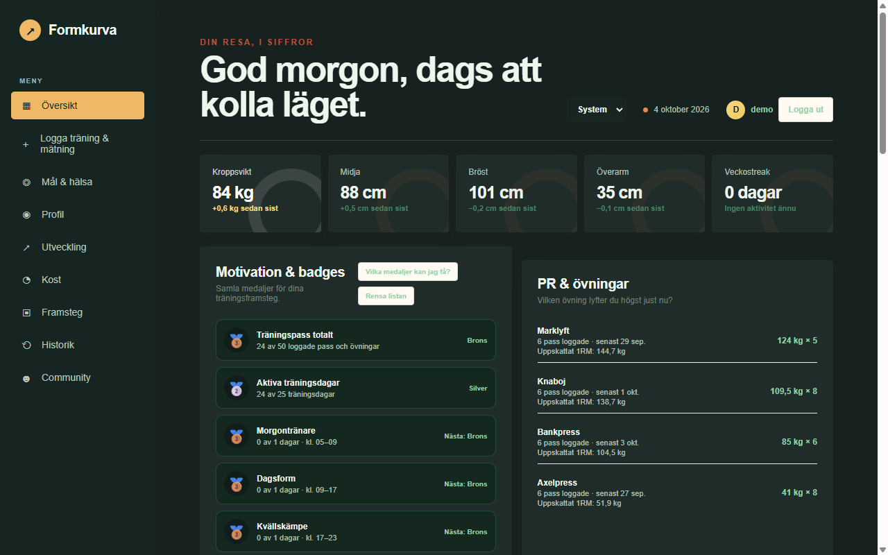
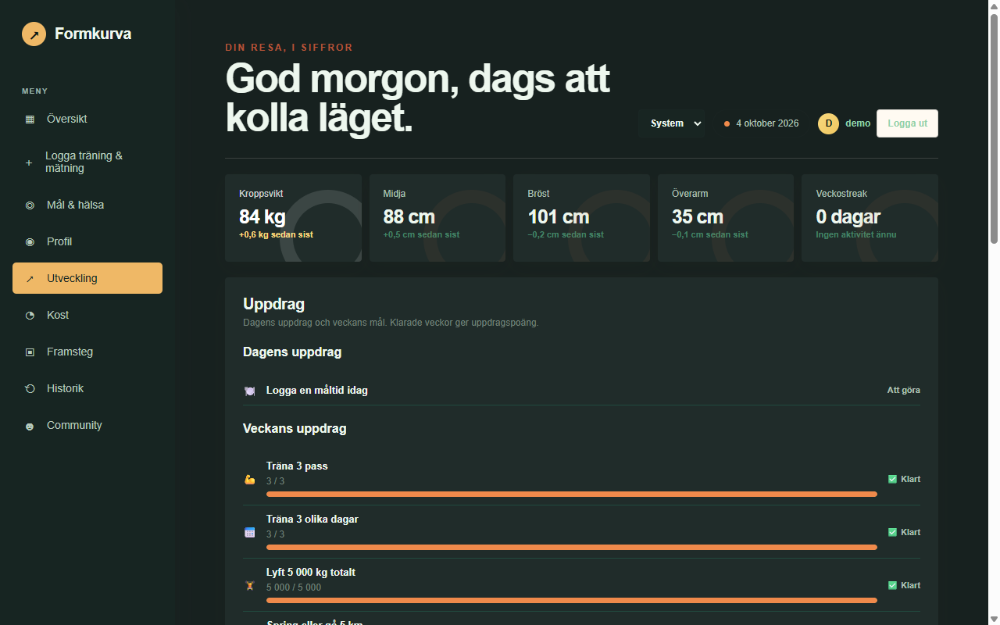
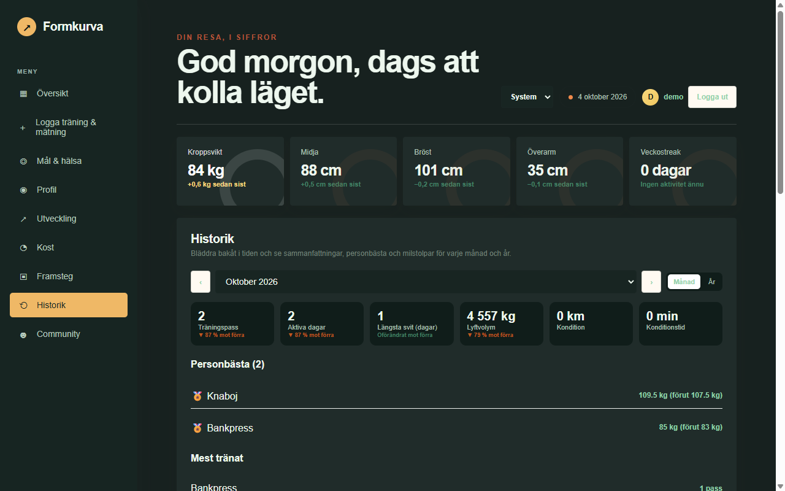
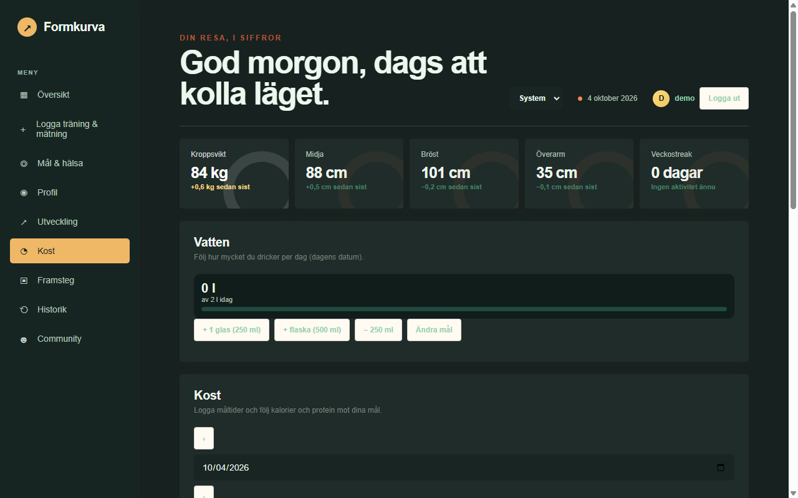

# Formkurva

Formkurva är en svensk webbapp för att logga och följa din träning och kropp, med konton för flera användare och en social community-del. Allt sparas i en PostgreSQL-databas på din egen server, så du äger din data. Appen körs i Docker och fungerar bra på en liten Proxmox-VM, en LXC, en Raspberry Pi eller vilken Linux-server som helst.

Tekniken är Node.js, Express och PostgreSQL. Gränssnittet är en enda webbsida som även kan installeras som app på mobilen (PWA).

## Snabbinstallation (kopiera och klistra in)

På en ren Debian- eller Ubuntu-server (VM, LXC eller Raspberry Pi), logga in och klistra in **en** rad. Skriptet installerar allt själv (git, Docker, Formkurva) och ställer inga frågor:

```bash
curl -fsSL https://raw.githubusercontent.com/richardstenlund/formkurva/main/install.sh | sudo bash
```

Är du redan inloggad som root (vanligt i LXC) kan du köra utan `sudo`:

```bash
curl -fsSL https://raw.githubusercontent.com/richardstenlund/formkurva/main/install.sh | bash
```

När det är klart visas adressen och en engångsinloggning (installationskonto). Öppna adressen, logga in och sidan guidar dig att skapa din egen administratör. Se [Första inloggningen](#första-inloggningen).

## Innehåll

- [Vad sidan gör](#vad-sidan-gör)
- [Systemkrav](#systemkrav)
- [Installation steg för steg](#installation-steg-för-steg)
- [Första inloggningen](#första-inloggningen)
- [Inställningar (.env)](#inställningar-env)
- [Uppdatera](#uppdatera)
- [Säkerhetskopiera och återställa](#säkerhetskopiera-och-återställa)
- [Publicera på internet](#publicera-på-internet)
- [Felsökning](#felsökning)
- [Köra lokalt utan Docker (utveckling)](#köra-lokalt-utan-docker-utveckling)

## Vad sidan gör

| Översikt | Utveckling |
|---|---|
|  |  |
| **Historik** | **Kost** |
|  |  |

- **Logga:** kroppsmått (vikt, midja, bröst, arm, lår, höft), styrketräning med set, reps och vikt, samt kondition (promenad, jogging, löpning). Vilotimer och passklocka ingår.
- **Följa utvecklingen:** personbästa, beräknad 1RM, platåvarning, medaljer, dagliga och veckovisa uppdrag, återhämtning, grafer, träningsprogram och BMI.
- **Historik:** bläddra månad för månad eller år för år med sammanfattning, milstolpar och kalender, och skapa en delbar årsbild.
- **Kost och framsteg:** måltider med kalorier och makron, vattenlogg, kalori- och proteinmål och privata framstegsbilder med före/efter.
- **Community:** vänner, peppning, topplistor, utmaningar, månadssäsonger, grupper med chatt och notiser. Kroppsmått, kost, bilder och e-post delas aldrig, och du kan dölja dig helt.
- **Konton:** inloggning med e-post, glömt lösenord, egen JSON-backup (Profil) och en adminsida (`/admin.html`) för konton och roller.

## Systemkrav

- **Server:** Linux (Debian 12 eller Ubuntu 22.04/24.04, i VM, LXC eller Raspberry Pi 4/5), x86-64 eller ARM64.
- **Resurser:** minst 1 GB RAM (2 GB rekommenderas) och 5 GB disk.
- **Programvara:** Docker med Compose v2 och Git (installeras automatiskt av snabbinstallationen).
- **Nätverk:** port 3000 för sidan och valfritt 8081 för Adminer. Internet krävs vid installation. Ingen domän behövs i hemmanätverket, se [Publicera på internet](#publicera-på-internet) för åtkomst utifrån.

## Installation steg för steg

Alla kommandon körs på servern, via SSH eller konsolen. Exemplen utgår från Debian/Ubuntu.

<details>
<summary>Installera Git och Docker för hand (behövs inte med snabbinstallationen)</summary>

```bash
sudo apt update && sudo apt install -y git curl ca-certificates
curl -fsSL https://get.docker.com | sudo sh
sudo usermod -aG docker $USER   # logga ut och in efteråt
docker compose version
```

I en Proxmox-LXC måste `nesting` och `keyctl` vara aktiverade (Options > Features).
</details>

### Snabbinstallation med skript (rekommenderas)

```bash
curl -fsSL https://raw.githubusercontent.com/richardstenlund/formkurva/main/install.sh | sudo bash
```

Skriptet kräver ingen inmatning och:
1. installerar git, curl och Docker om de saknas (Debian/Ubuntu),
2. klonar projektet till `/opt/formkurva`,
3. skapar `.env` med slumpade lösenord för databasen och installationskontot, och adressen `http://<serverns IP>:3000`,
4. bygger och startar alla containrar och väntar tills sidan svarar,
5. skriver ut adress och inloggning.

Vill du styra något sätter du det före kommandot, t.ex. `APP_URL=https://formkurva.example.se curl ... | sudo -E bash`. Stöds: `ADMIN_EMAIL`, `ADMIN_PASSWORD`, `APP_URL`, `FORMKURVA_DIR`. En befintlig `.env` lämnas alltid orörd.

### Manuell installation

```bash
git clone https://github.com/richardstenlund/formkurva.git
cd formkurva
cp .env.example .env
nano .env            # byt ADMIN_EMAIL, ADMIN_PASSWORD, DB_PASSWORD och APP_URL
docker compose up -d --build
```

Spara i nano med `Ctrl+O`, `Enter`, avsluta med `Ctrl+X`. Första bygget tar någon minut.

### Kontrollera att det körs

```bash
docker compose ps
```

Du ska se fyra containrar med status `running`/`healthy`:

| Container | Uppgift |
|---|---|
| `formkurva` | Webbappen på port 3000 |
| `formkurva-db` | PostgreSQL-databasen |
| `formkurva-adminer` | Databasverktyg i webbläsaren på port 8081 (valfri) |
| `formkurva-backup` | Daglig automatisk databasdump |

Öppna `http://SERVERNS-IP:3000`. Hitta serverns IP med `hostname -I`. Du kan också testa hälsokontrollen: `curl http://localhost:3000/api/health`.

### Brandvägg

Om du använder `ufw`:

```bash
sudo ufw allow 3000/tcp
sudo ufw allow 8081/tcp   # bara om du vill nå Adminer från andra datorer
```

## Första inloggningen

1. Öppna sidan och tryck **Logga in**.
2. Logga in med installationskontot (`ADMIN_EMAIL` och `ADMIN_PASSWORD`, skrivs ut av installationen och finns i `.env`).
3. Sidan tvingar dig nu att **skapa en ny administratör** (e-post och lösenord på minst 12 tecken). Tills det är gjort går inget annat att göra med installationskontot.
4. Logga in med din nya administratör. Högst upp visas en **röd varning** tills du tagit bort installationskontot. Tryck **Ta bort installationskontot** (eller radera det under Admin). Varningen visas för alla administratörer tills det är borttaget.
5. Andra användare registrerar sig själva på inloggningsrutan. Du kan göra dem till administratörer under **Admin** i menyn.
6. Ange din längd under **Profil** för att få BMI, och välj ett visningsnamn så att vänner kan hitta dig.

Installationskontot skapas bara vid en helt ny databas. Befintliga installationer som uppdateras får inget sådant konto.

## Säkerhet

- Lösenord lagras hashade (scrypt) och sessioner ligger i HttpOnly-cookies.
- Administratörslösenord måste vara minst 12 tecken, och installationskontot kan bara användas för att skapa en riktig admin.
- Inloggning är begränsad till 8 försök per 15 minuter, och nya konton till 10 per timme och IP.
- Skrivande API-anrop med fel `Origin` blockeras (CSRF-skydd).
- Endast sidans egna filer serveras. Serverkod och `package.json` går inte att hämta.
- Content-Security-Policy och övriga säkerhetshuvuden skickas. Med `SECURE_COOKIES=true` aktiveras även HSTS och Secure-cookies, vilket du bör göra bakom HTTPS.
- Port 8081 (Adminer) bör inte nås från internet. Begränsa den med brandvägg.

## Inställningar (.env)

Filen `.env` ligger i projektmappen och ska aldrig läggas upp på GitHub. Efter ändring: `docker compose up -d`.

| Variabel | Betydelse |
|---|---|
| `ADMIN_EMAIL` / `ADMIN_PASSWORD` | Adminkontot som skapas automatiskt |
| `DB_NAME`, `DB_USER`, `DB_PASSWORD` | Databasuppgifter. Byt lösenordet till något långt och slumpat |
| `APP_URL` | Adressen sidan nås på. Används i länkar i e-post |
| `SMTP_HOST`, `SMTP_PORT`, `SMTP_SECURE`, `SMTP_USER`, `SMTP_PASSWORD`, `SMTP_FROM` | E-postserver för "glömt lösenord". Utan SMTP skrivs länken i serverloggen (`docker logs formkurva`) |

Inställningar som sätts i `docker-compose.yml`:

| Variabel | Standard | Betydelse |
|---|---|---|
| `SECURE_COOKIES` | `false` | Sätt till `true` när sidan körs bakom HTTPS. Vid vanlig HTTP i hemnätet måste den vara `false`, annars går det inte att logga in |
| `SESSION_DAYS` | `30` | Hur länge man förblir inloggad |
| `PORT` | `3000` | Port inuti containern. Ändra den yttre porten under `ports:` |

Vill du använda en annan port än 3000, ändra till exempel `"3000:3000"` till `"8080:3000"` i `docker-compose.yml` och uppdatera `APP_URL`.

## Uppdatera

```bash
cd ~/formkurva
git pull --ff-only
docker compose up -d --build
```

Din data ligger i en Docker-volym och påverkas inte. Tryck **Ctrl+F5** i webbläsaren efteråt så att den nya versionen hämtas. Du kan också köra `install.sh` igen. Det uppdaterar utan att röra din `.env`.

Se loggar vid problem: `docker compose logs -f formkurva`.

## Säkerhetskopiera och återställa

**Automatiskt:** containern `formkurva-backup` skapar en komprimerad dump varje dygn och sparar 14 dagar i volymen `formkurva_backups`. Titta på filerna:

```bash
docker compose exec backup ls -lh /backups
```

**Manuell dump:**

```bash
docker compose exec -T db pg_dump -U formkurva -d formkurva > formkurva.sql
```

**Återställa en dump** (skriver över befintlig data):

```bash
docker compose exec -T db psql -U formkurva -d formkurva < formkurva.sql
```

Kopiera gärna dumparna till en annan dator eller NAS, eftersom en backup på samma disk inte skyddar mot diskfel. Varje användare kan dessutom ladda ner sin egen data som JSON under **Profil > Säkerhetskopia**.

**Adminer** (databasvy) finns på `http://SERVERNS-IP:8081`. Välj system PostgreSQL, server `db`, användare och databas `formkurva` och lösenordet från `DB_PASSWORD`. Exponera inte Adminer mot internet. Vill du slippa det helt, ta bort `adminer`-blocket i `docker-compose.yml`.

## Publicera på internet

Kör bara sidan mot internet med HTTPS. Alternativ:

- **Cloudflare Tunnel**, ingen portöppning i routern behövs.
- **Caddy** eller **Nginx Proxy Manager** som reverse proxy med Let's Encrypt-certifikat.

Gör sedan så här:
1. Sätt `SECURE_COOKIES: "true"` i `docker-compose.yml` och `APP_URL` till din https-adress i `.env`.
2. Kör `docker compose up -d --build`.
3. Exponera inte PostgreSQL (5432) eller Adminer (8081) mot internet.
4. Konfigurera SMTP så att "glömt lösenord" fungerar.
5. Använd långa, unika lösenord för admin och databas.

Systemnotiser i webbläsaren kräver HTTPS (eller localhost). Utan HTTPS visas notiser bara inne i sidan.

## Felsökning

| Problem | Lösning |
|---|---|
| Sidan svarar inte | `docker compose ps` och `docker compose logs formkurva`. Kontrollera brandvägg och att du använder rätt IP och port |
| Går inte att logga in över HTTP | Kontrollera att `SECURE_COOKIES` är `false` när du inte använder HTTPS |
| `permission denied` mot Docker | Kör `sudo usermod -aG docker $USER` och logga ut och in igen |
| Docker startar inte i Proxmox LXC | Aktivera `nesting` och `keyctl` för containern |
| Appen startar om hela tiden | Titta i loggen. Oftast fel eller saknade värden i `.env` |
| Ändrade `.env` men inget händer | Kör `docker compose up -d` så att containrarna skapas om |
| Gammalt utseende efter uppdatering | Tryck Ctrl+F5 eller rensa webbplatsdata för sidan |
| Glömt adminlösenord | Använd **Glömt lösenord** på inloggningen (kräver SMTP, annars hittar du länken i `docker logs formkurva`). `ADMIN_PASSWORD` används bara när adminkontot skapas första gången |
| Börja om från noll | `docker compose down -v` raderar containrar **och all data**. Använd bara om du är säker |

## Köra lokalt utan Docker (utveckling)

Kräver Node.js 22 (samma som Docker-avbilden) och en PostgreSQL-databas.

```bash
git clone https://github.com/richardstenlund/formkurva.git
cd formkurva
npm install
DB_HOST=localhost DB_USER=formkurva DB_PASSWORD=hemligt DB_NAME=formkurva \
ADMIN_EMAIL=admin@example.com ADMIN_PASSWORD=ettLangtLosenord123 node server.js
```

Öppna `http://localhost:3000`. Tabellerna skapas automatiskt vid start.

## Projektets filer

| Fil | Innehåll |
|---|---|
| `server.js` | Backend, API och databasschema |
| `MyHome.html` | Hela användargränssnittet |
| `admin.html` | Adminsidan |
| `reset-password.html` | Sidan för återställning av lösenord |
| `sw.js`, `manifest.webmanifest` | Offline-stöd och installation som app |
| `Dockerfile`, `docker-compose.yml` | Containerbygge och tjänster |
| `install.sh` | Installationsskript |
| `.env.example` | Mall för inställningar |
